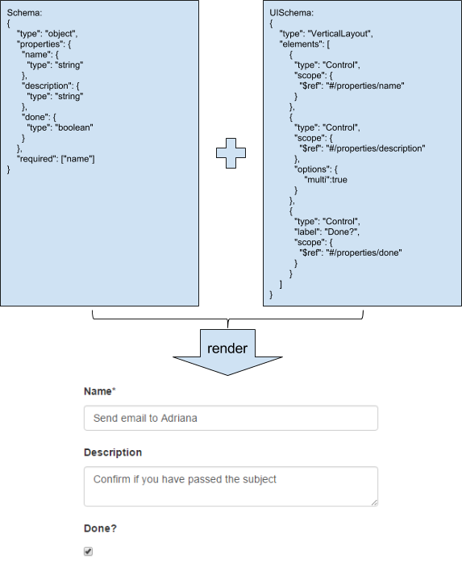
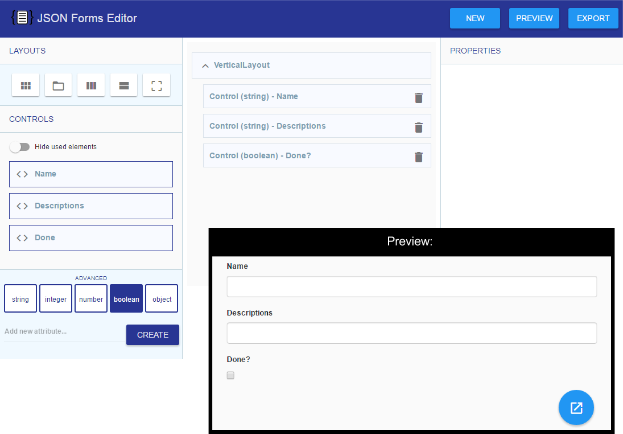
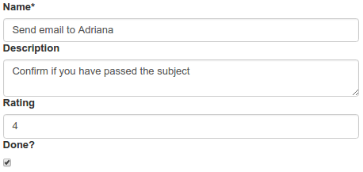

INTRODUCTION
============

JSON Forms is a framework to efficiently build form-based web UIs. These UIs are targeted at entering, modifying, and viewing data and are usually embedded within an application.

JSON Forms eliminates the need to write HTML templates and Javascript for data binding by hand to create customizable forms by leveraging the capabilities of JSON and [JSON schema](http://json-schema.org) and providing a simple and declarative way of describing forms. Forms are then rendered with a UI framework, currently one that is based on AngularJS.

The following diagram shows all main components of JSON Forms. Any UI is defined using two schemata: The data schema defines the underlying data to be shown in the UI (object types and their properties). The UI schema defines how this data is rendered as a form, e.g. the order of controls, their visibility and the layout. Both artefacts are interpreted during runtime by the rendering component. It translates the schemas into an AngularJS based UI, which is already fully functional including data binding, validation, etc. The following diagram show a functional overview. On the left, you see a simple JSON schema defining a data object "Task" with three properties. On the right, you see a UI schema, which defines those three properties should be shown as controls in the UI. It therefore references the data schema. Additionally, it adds UI-specific concerns, e.g. that the "description" control is multi-line and that the "done" control uses an adapted label ("Done?"). All other information, e.g. the property type, or mandatory properties (in the example "name") are derived from the data schema.
Based on those two schemata, the rendering component of JSON Forms produces the fully functional UI as shown below.

{:.img-responsive}

Please follow the section [Define your first form](#/docs/firstform) to learn the simple steps necessary for producing such as form.

For the declarative description of a form, JSON forms uses a simple JSON format, which can be created using any editor of choice. However, JSON Forms also provides advanced tooling for creating and modifying UI schemata including a tree-based editor and a live preview. Please see this section to learn more about the editor.

{:.img-responsive}

JSON Forms provides default renderers for all data types, however, you can change the way things are rendered by providing [custom renderers](#/docs/customrenderer). In the following example, the attribute "done" is rendered with a custom renderer, which is plugged into the framework. As you can see, the boolean value is not displayed as a checkbox anymore, but rather, using radio buttons. By plugging in custom renderers, you can adapt the UI created by JSON Forms to your requirements and also support domain specific data types and visualizations.

{:.img-responsive}
